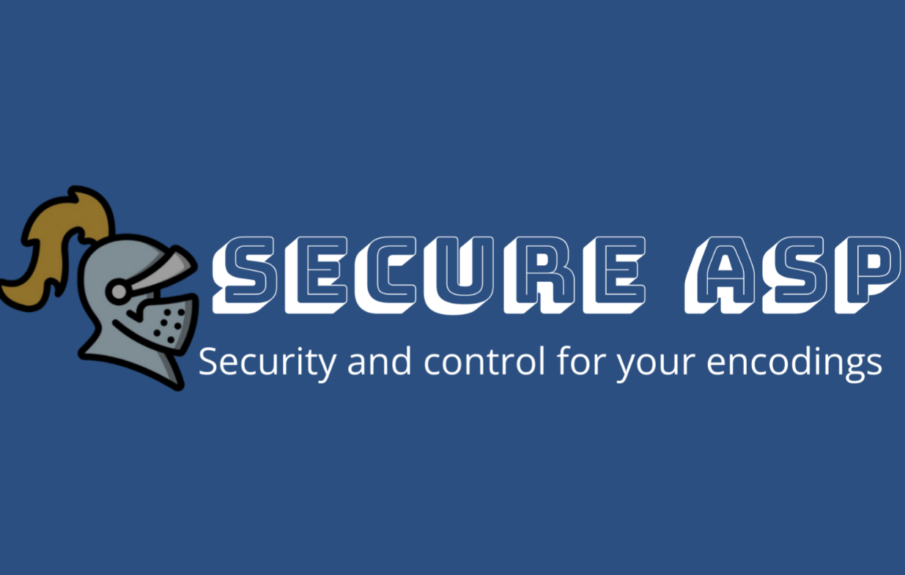

  

##

### Application for securely managing and sharing signed ASP encodings ​
This thesis focuses on the development of an application designed to securely manage and share ASP (Answer Set Programming) encodings, addressing the main challenges related to data protection. Among the critical issues analyzed are the compromise of file integrity, unauthorized access and the difficulty of reliably verifying the identity of those who interact with the data. To address these needs, a system has been designed that ensures unique user identification, combining the use of identity documents and digital certificates. This approach allows to securely associate the identity of each participant to the operations performed, ensuring authenticity, integrity and confidentiality of ASP files. ​

#  Demo Video 

  

